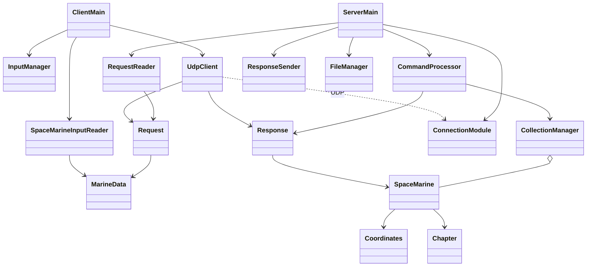

# Лабораторная работа №6. Вариант 440

## Задание

Полный исходный текст задания приведён в [lab6_requirements.md](lab6_requirements.md).
Цель — преобразовать приложение пятой лабораторной в клиент-серверную систему
с UDP, сериализацией объектов, Stream API и серверным Log4j2.

## Реализация

Программа состоит из трёх исходных модулей и двух исполняемых JAR-файлов.
Общий модуль содержит модели и протокол. Клиент читает и проверяет поля, создаёт
`Request`, отправляет его и отображает `Response`. Сервер принимает фрагменты через
неблокирующий `DatagramChannel`, восстанавливает запрос, выполняет команду и отправляет ответ.

Коллекцией `LinkedList<SpaceMarine>` владеет сервер. Поиск, преобразования, фильтрация,
подсчёт, уникальные значения и сортировка реализованы потоками и лямбда-выражениями.
Сортировка по умолчанию сравнивает здоровье, затем id. `show` и фильтрация возвращают
отсортированные объекты, даже после `shuffle`.

Назначение id и creationDate происходит на сервере. При обновлении они сохраняются.
Клиент передаёт `MarineData`, в котором этих полей нет. Поля проверяются повторно
на сервере, поскольку Java-десериализация обычных классов не вызывает их конструкторы.

Серверный цикл выполняет чтение, обработку, отправку и команды консоли последовательно.
Для UDP новое подключение трактуется как первое появление адреса отправителя,
поскольку этот протокол не устанавливает соединение. Log4j2 фиксирует запуск,
появление клиентов, запросы, дубликаты, ответы, ошибки и сохранение.

Сохранение доступно только серверу: команды `SAVE` нет в сетевом перечислении.
При нормальном завершении и сигналах, обрабатываемых JVM, выполняется запись JSON.
Клиентский выход завершает только клиент. Ввод скриптов, история и защита от рекурсии
также находятся на клиенте.

## Диаграмма классов

Полная диаграмма: [output/lab6-classes.puml](output/lab6-classes.puml).

## Исходный код

Исходники являются приложением к отчёту в репозитории:

- [Общие классы](common/src/main/java/itmo/lab6).
- [Клиент](client/src/main/java/itmo/lab6).
- [Сервер](server/src/main/java/itmo/lab6/server).
- [Конфигурация Log4j2](server/src/main/resources/log4j2.xml).
- [Сборка](build.sh) и [интеграционные проверки](tests/integration.py).

## Проверка

Команды `sh build.sh` и `python3 tests/integration.py` проверяют реальный UDP-обмен
между процессами. Покрыты типизированные команды, автоматические поля, повторное
исполнение одного UUID, большие фрагментированные ответы, сортировка после перемешивания,
валидация на обеих сторонах, неверные пакеты, полный демонстрационный скрипт,
рекурсия, серверное сохранение, нормальная остановка и SIGTERM.

Отдельный UDP-прокси теряет первый ответ на добавление: клиент повторяет запрос,
сервер возвращает кеш, число элементов увеличивается ровно на один. Также проверяется
появление сервера после временной недоступности и сохранность повреждённого JSON.

## Выводы

Приложение разделено на независимые процессы с общим объектным протоколом.
UDP требует явного контроля тайм-аута, повторов, идентификации запросов и сборки
фрагментов. Неблокирующий канал позволяет одному серверному потоку обслуживать
несколько клиентов и локальную консоль. Stream API задаёт обработку коллекции
как последовательность фильтраций, преобразований и терминальных операций.

Ограничения реализации: сообщение до 4 МиБ, кеш ответов до 5 минут/512 запросов/32 МиБ,
отсутствие постоянного журнала UUID между перезапусками. Подробные команды запуска,
включая Helios, приведены в [README.md](README.md).
